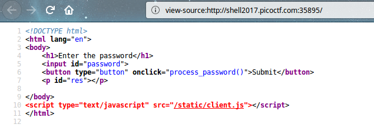
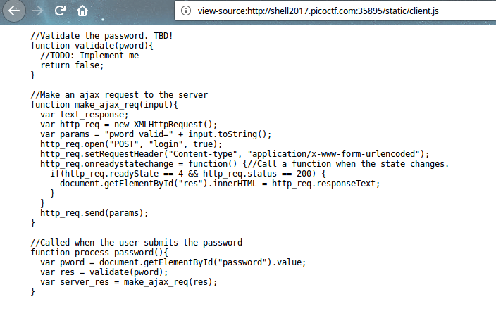
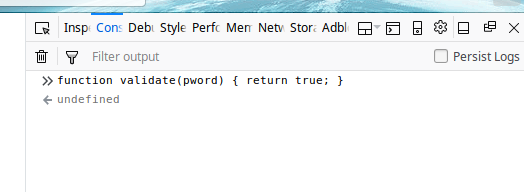
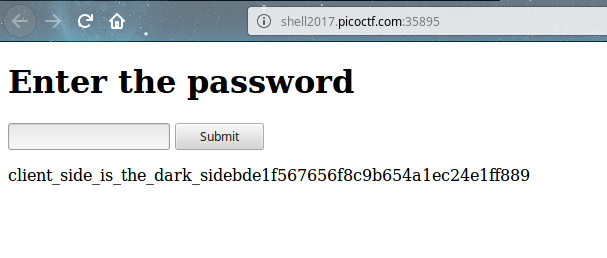

# Level 1 Master Challenge - Lazy Dev [ 50 Pts ]

## Problem

I really need to login to this [website](http://shell2017.picoctf.com:35895/), but the developer hasn't implemented login yet. Can you help?

## Approach

From the above, we see that `process_password()` function is called when click submit.

From the static client javascript, we see that `process_password()` will call `validate(pword)`. The validate function will always return false.

Due to the checking implemented in javascript, we can open up browser javascript console and overwrite the validate function as shown above

When we click submit, validate returns true and we got out flag.

The flag is client_side_is_the_dark_sidebde1f567656f8c9b654a1ec24e1ff889

(Completed)
