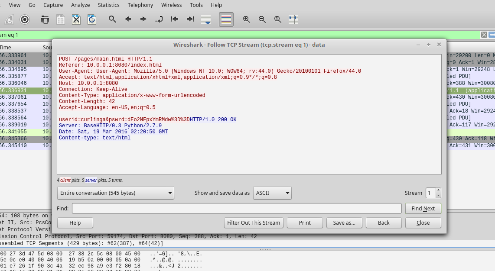

# Digital Camouflage [ 50 Pts ]

## Problem

We need to gain access to some routers. Let's try and see if we can find the password in the captured network data: [data.pcap](./data.pcap).

## Approach

Since a pcap file was given, we can proceed to use wireshark to see what network packets have been captured inside.


From the above, we can see that there is a HTTP protocol which many routers tend to use.


by filtering http protocol, we see an interesting HTTP POST packet.


By following the TCP stream of the post request, we got the password of the router!

dEo2NFpxYmRMdw==

However, the password is encoded in base64 format which can be easily decoded in bash using the following.

```sh
echo -n dEo2NFpxYmRMdw== | base64 -d
```

The flag is tJ64ZqbdLw

(Completed)


