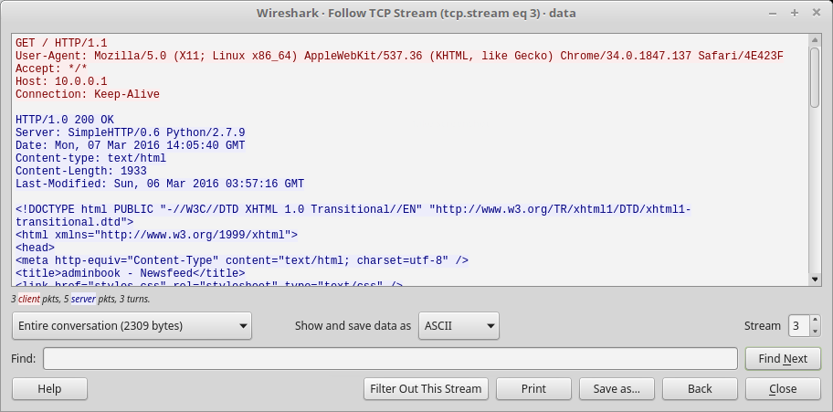

# Special Agent User [ 50 Pts ]

## Problem

We can get into the Administrator's computer with a browser exploit. But first, we need to figure out what browser they're using. Perhaps this information is located in a network packet capture we took: [data.pcap](./data.pcap). Enter the browser and version as "BrowserName BrowserVersion". NOTE: We're just looking for up to 3 levels of subversions for the browser version (ie. Version 1.2.3 for Version 1.2.3.4) and ignore any 0th subversions (ie. 1.2 for 1.2.0)

## Approach

Since we know it is a browser, we can filter wireshark based on HTTP protocol.
We can choose to follow TCP stream of any HTTP packet and keep moving to the next stream until we stop seeing wget.

The flag is Chrome 34.0.1847.137

(Completed)
