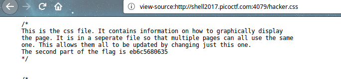

# What is Web [ 20 Pts ]

## Problem

Someone told me that [some guy](https://en.wikipedia.org/wiki/Tim_Berners-Lee) came up with the "World Wide Web", using "HTML" and "stuff". Can you help me figure out what that is? [Website](http://shell2017.picoctf.com:4079/).

(if link broken see [here](./WGET/index.html))

## Approach

There are 3 parts to the flag just as there are 3 files on the website.

First Part: Right Click to view source. 

Second Part: See CSS file

Third Part: See js file

The flag is 9daca0510ffeb6c5680635f1ef52d049f

(Completed)
