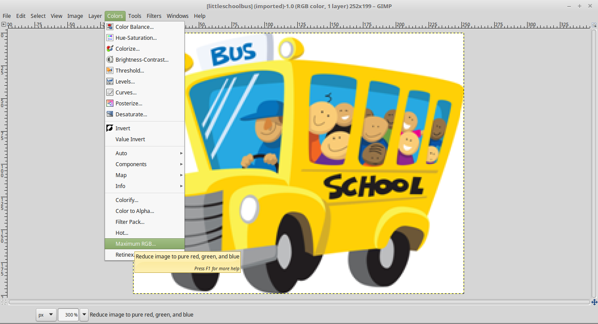
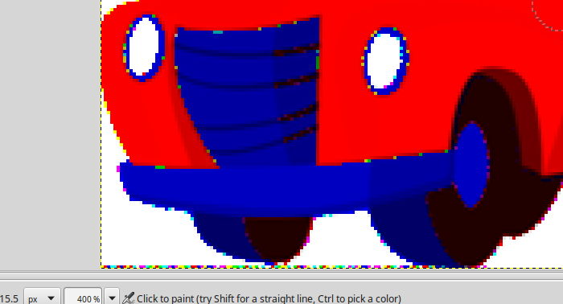
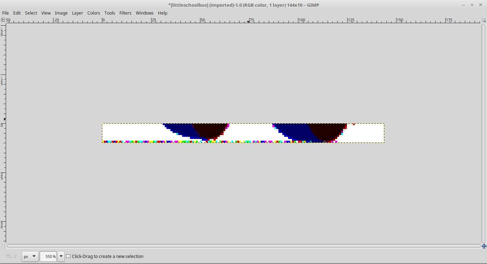
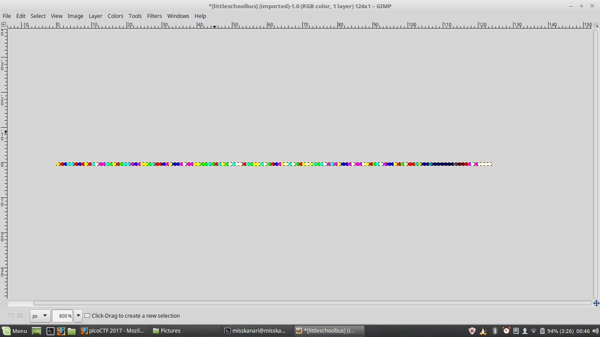

# Little School Bus [ 75 Pts ]

## Problem

Can you help me find the data in this littleschoolbus.bmp?

HINTS

Look at least significant bit encoding!!

## Approach

This is image steganography. Since the hint mentioned LSB encoding, we can first verify and narrow down which part of the image contains data.
Fortunately, this can be detected using photoshop or GIMP (open source free photoshop).

In this write up, I will use GIMP.



By Boosting the RGB value, bits were amplified greatly so that continuous data can be visualized by a cluster of rainbows pixels.



After, maximizing the RGB values, we can see that the bottom left corner has cluster of rainbow pixels. This indicate possible LSB encoding to hide data.



Crop out the rest and focus on cropping out only the rainbox areas. You should crop out the image after undoing the RGB filtering.



Crop out as much as one can and export this to work on using a python script.

```python
fo = open("littleschoolbus2.bmp", "rb")
data = fo.read()
fo.close()

b = ''
for imbyte in data:
	b+=str(ord(imbyte) & 1)		# get only the last bit

#print b
#print len(b)

for i in range(8):
	bb = b[i:i+len(b)-(len(b)%8)]
#	print i, bb
	bbh = format(int(bb, base=2), 'x')
	if len(bbh) % 2:
		bbh = '0'+bbh
#	print i, bbh
	print i, repr(bbh.decode('hex'))
	print

```

## Output

```

0 'P\x00\x02 \x130\x01@\x00\x00\x00\x00\x00\x00\x00\x19\x9b\x18Y\xde\xdc\x99[Y[X\x99\\\x97\xda\xdaY\x1c\xd7\xdc\x1c\x9b\xdd\x19X\xdd\x17\xde[\xdd\\\x97\xda\x19XY\x19\\\x9c\xd7\xd8\xccXL\xdf\x7f'

1 '\xa0\x00\x04@&`\x02\x80\x00\x00\x00\x00\x00\x00\x00360\xb3\xbd\xb92\xb6\xb2\xb6\xb12\xb9/\xb5\xb4\xb29\xaf\xb897\xba2\xb1\xba/\xbc\xb7\xba\xb9/\xb42\xb0\xb22\xb99\xaf\xb1\x98\xb0\x99\xbe\xff'

2 '@\x00\x08\x80L\xc0\x05\x00\x00\x00\x00\x00\x00\x00\x00flag{remember_kids_protect_your_headers_c1a3}\xff'

3 '\x80\x00\x11\x00\x99\x80\n\x00\x00\x00\x00\x00\x00\x00\x00\xcc\xd8\xc2\xce\xf6\xe4\xca\xda\xca\xda\xc4\xca\xe4\xbe\xd6\xd2\xc8\xe6\xbe\xe0\xe4\xde\xe8\xca\xc6\xe8\xbe\xf2\xde\xea\xe4\xbe\xd0\xca\xc2\xc8\xca\xe4\xe6\xbe\xc6b\xc2f\xfb\xff'

4 '"\x013\x00\x14\x00\x00\x00\x00\x00\x00\x00\x01\x99\xb1\x85\x9d\xed\xc9\x95\xb5\x95\xb5\x89\x95\xc9}\xad\xa5\x91\xcd}\xc1\xc9\xbd\xd1\x95\x8d\xd1}\xe5\xbd\xd5\xc9}\xa1\x95\x85\x91\x95\xc9\xcd}\x8c\xc5\x84\xcd\xf7\xff'

5 'D\x02f\x00(\x00\x00\x00\x00\x00\x00\x00\x033c\x0b;\xdb\x93+k+k\x13+\x92\xfb[K#\x9a\xfb\x83\x93{\xa3+\x1b\xa2\xfb\xcb{\xab\x92\xfbC+\x0b#+\x93\x9a\xfb\x19\x8b\t\x9b\xef\xff'

6 "\x88\x04\xcc\x00P\x00\x00\x00\x00\x00\x00\x00\x06f\xc6\x16w\xb7&V\xd6V\xd6&W%\xf6\xb6\x96G5\xf7\x07&\xf7FV7E\xf7\x96\xf7W%\xf6\x86V\x16FW'5\xf63\x16\x137\xdf\xff"

7 "\x88\x04\xcc\x00P\x00\x00\x00\x00\x00\x00\x00\x06f\xc6\x16w\xb7&V\xd6V\xd6&W%\xf6\xb6\x96G5\xf7\x07&\xf7FV7E\xf7\x96\xf7W%\xf6\x86V\x16FW'5\xf63\x16\x137\xdf\xff"

```

The flag is flag{remember_kids_protect_your_headers_c1a3}

(Completed)
